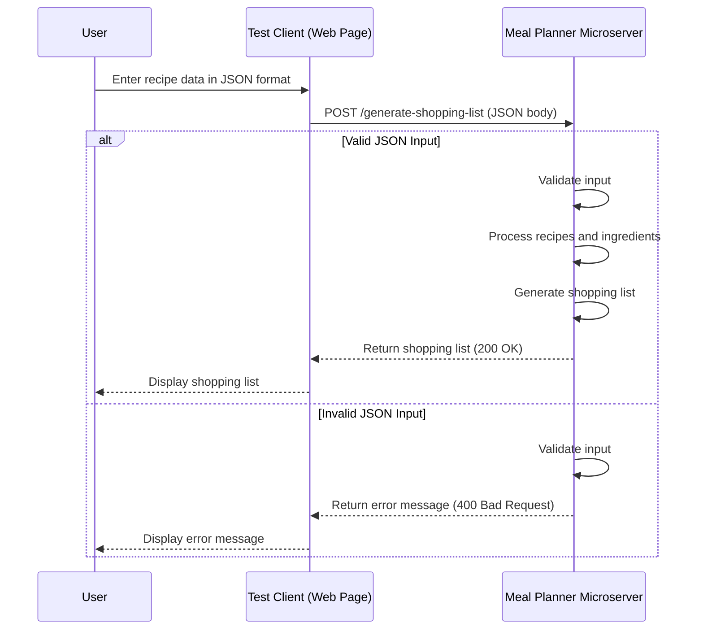

# Communication Contract
Meal Planner Microservice "A" Implementation Code 

## Requesting Data

The microservice is set up to receive HTTP POST requests at http://localhost:3000/generate-shopping-list. To make a request, you need to send a JSON payload containing a list of recipes, each with its own ingredients. To request a shopping list, format the data as follows: 
{
  "recipes": [
    {
      "name": "Recipe Name",
      "ingredients": [
        { "ingredient": "exampleIngredient", "quantity": 2, "unit": "cup" }
      ]
    }
  ]
}. 

An example call is as follows: 

const microserviceURL = 'http://localhost:3000/generate-shopping-list';

const requestData = {
  recipes: [
    {
      name: "Carrot Salad",
      ingredients: [
        { ingredient: "carrot", quantity: 1, unit: "cup" },
        { ingredient: "onion", quantity: 0.5, unit: "cup" }
      ]
    }
  ]
};

const response = await fetch(microserviceURL, {
  method: 'POST',
  headers: { 'Content-Type': 'application/json' },
  body: JSON.stringify(requestData)
});

const shoppingList = await response.json();
console.log('Received Shopping List:', shoppingList);

## Receiving Data

To receive data from the microservice, make sure you have sent the HTTP POST request as shown previously. The fetch function will handle both sending the request and waiting for the response. 

An example call is as follows: 

const response = await fetch(microserviceURL, {
      method: 'POST',
      headers: {
        'Content-Type': 'application/json'
      },
      body: JSON.stringify(requestData)
    });

## UML Sequence Diagram 

